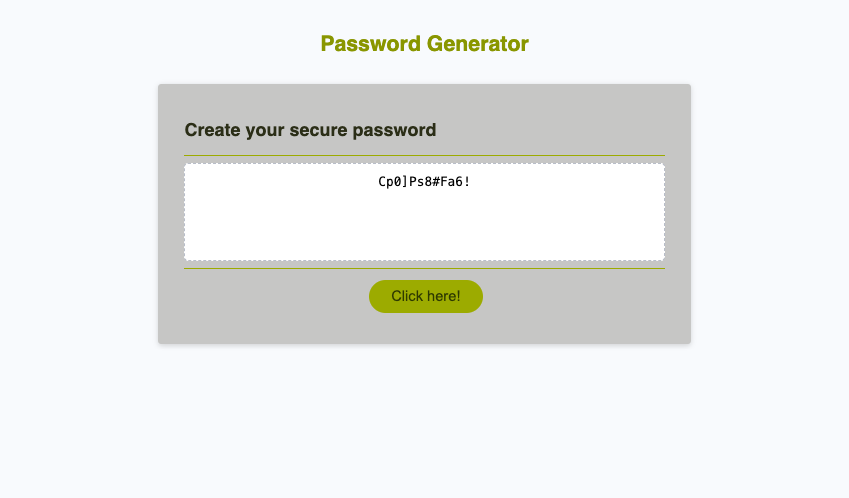

# passwordgenerator

## Description

As part of this activity, we will create a web application that generates random passwords according to the following criteria.

- The length of the password:
    At least 8 characters but no more than 128.

- Character types:
    Lowercase
    Uppercase
    Numeric
    Special characters ($@%&*, etc)

The purpose of this project is to demonstrate the application of the learned knowledge of JavaScript by using different arrays and executing functions that allow us to create and validate a number of conditions.
We have used HTML and JavaScript to construct a dynamic user interface in this example.

## Usage

> To access the url of this application click https://nazaretrueda.github.io/passwordgenerator/

## Credits

> https://www.shecodes.io/athena/3645-how-to-write-an-if-statement-with-typos-and-uppercase-insensitive-in-javascript#:~:text=You%20can%20use%20String.,it%20to%20the%20string%20example%20

> https://www.w3schools.com/jsref/jsref_random.asp

> https://edabit.com/tutorial/javascript#arrays

> https://developer.mozilla.org/en-US/docs/Web/JavaScript/Reference/Global_objects/Object/values

> https://www.geeksforgeeks.org/javascript-program-to-count-the-number-of-keys-properties-in-an-object/

## License

MIT License

Copyright (c) 2023 Naz

Permission is hereby granted, free of charge, to any person obtaining a copy
of this software and associated documentation files (the "Software"), to deal
in the Software without restriction, including without limitation the rights
to use, copy, modify, merge, publish, distribute, sublicense, and/or sell
copies of the Software, and to permit persons to whom the Software is
furnished to do so, subject to the following conditions:

The above copyright notice and this permission notice shall be included in all
copies or substantial portions of the Software.

THE SOFTWARE IS PROVIDED "AS IS", WITHOUT WARRANTY OF ANY KIND, EXPRESS OR
IMPLIED, INCLUDING BUT NOT LIMITED TO THE WARRANTIES OF MERCHANTABILITY,
FITNESS FOR A PARTICULAR PURPOSE AND NONINFRINGEMENT. IN NO EVENT SHALL THE
AUTHORS OR COPYRIGHT HOLDERS BE LIABLE FOR ANY CLAIM, DAMAGES OR OTHER
LIABILITY, WHETHER IN AN ACTION OF CONTRACT, TORT OR OTHERWISE, ARISING FROM,
OUT OF OR IN CONNECTION WITH THE SOFTWARE OR THE USE OR OTHER DEALINGS IN THE
SOFTWARE.